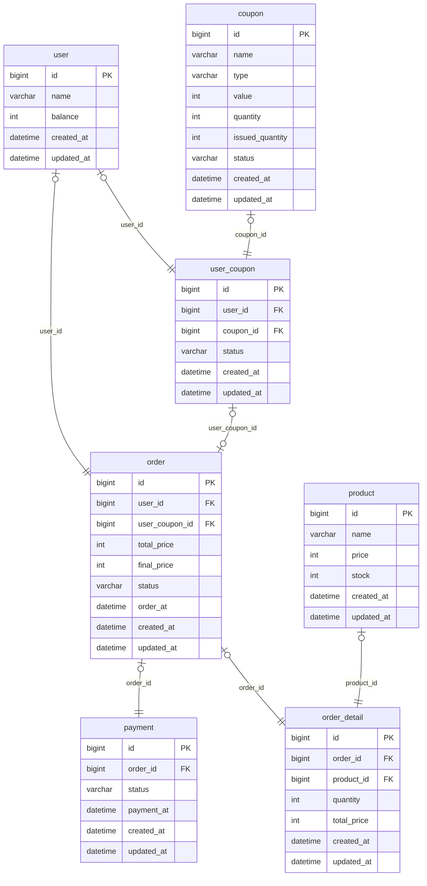

<h1>ERD</h1>

<h1>설계 내용</h1>

### USER
| 컬럼 이름    | 타입      | 제약 조건                  | 설명     |
|--------------|-----------|---------------------------|-----------|
| id           | BIGINT    | PK (Primary Key)          | 기본 키   |
| name         | VARCHAR   | NOT NULL                  | 유저 이름 |
| balance      | INT       | DEFAULT 0                 | 유저 잔액 |
| created_at   | DATETIME  |                           | 생성 일시 |
| updated_at   | DATETIME  |                           | 수정 일시 |

### PRODUCT
| 컬럼 이름    | 타입      | 제약 조건                  | 설명     |
|--------------|-----------|---------------------------|-----------|
| id           | BIGINT    | PK (Primary Key)          | 기본 키   |
| name         | VARCHAR   | NOT NULL                  | 상품 이름 |
| price        | INT       | DEFAULT 0                 | 상품 금액 |
| stock        | INT       | DEFAULT 0                 | 상품 재고 |
| created_at   | DATETIME  |                           | 생성 일시 |
| updated_at   | DATETIME  |                           | 수정 일시 |

### ORDER
| 컬럼 이름    | 타입      | 제약 조건                  | 설명     |
|--------------|-----------|---------------------------|-----------|
| id           | BIGINT    | PK (Primary Key)          | 기본 키   |
| user_id         | BIGINT   | FK (Foreign Key)  | 유저 외래키 |
| user_coupon_id  | BIGINT   | FK (Foreign Key)  | 유저 쿠폰 외래키 |
| payment_at   | DATETIME  |                           | 결제 완료 일시 |
| created_at   | DATETIME  |                           | 생성 일시 |
| updated_at   | DATETIME  |                           | 수정 일시 |

### ORDER_DETAIL
| 컬럼 이름    | 타입      | 제약 조건                  | 설명     |
|--------------|-----------|---------------------------|-----------|
| id           | BIGINT    | PK (Primary Key)          | 기본 키   |
| order_id     | BIGINT   | FK (Foreign Key)           | 주문 외래키 |
| product_id   | BIGINT   | FK (Foreign Key)           | 상품 외래키 |
| quantity     | INT       |  DEFAULT 0                | 주문 상품 수량 |
| total_price  | INT       |  DEFAULT 0                | 주문 상품 총 금액 |
| created_at   | DATETIME  |                           | 생성 일시 |
| updated_at   | DATETIME  |                           | 수정 일시 |

### COUPON
| 컬럼 이름    | 타입      | 제약 조건                  | 설명     |
|--------------|-----------|---------------------------|-----------|
| id           | BIGINT    | PK (Primary Key)          | 기본 키   |
| name         | VARCHAR   |  NOT NULL                 | 쿠폰 이름 |
| type         | VARCHAR   |  NOT NULL                 | 쿠폰 타입 |
| value        | INT       |  DEFAULT 0                | 쿠폰 값 (고정금액 or 할인) |
| quantity     | INT       |  DEFAULT 0                | 쿠폰 수량 |
| issued_quantity      | INT       |  DEFAULT 0        | 발급된 쿠폰 수량 |
| status      | VARCHAR       | NOT NULL               | 쿠폰 발급 가능 상태  |
| created_at   | DATETIME  |                           | 생성 일시 |
| updated_at   | DATETIME  |                           | 수정 일시 |

### USER_COUPON
| 컬럼 이름    | 타입      | 제약 조건                  | 설명     |
|--------------|-----------|---------------------------|-----------|
| id           | BIGINT    | PK (Primary Key)          | 기본 키   |
| user_id      | BIGINT   |  FK (Foreign Key)          | 유저 외래키 |
| coupon_id    | BIGINT   |  FK (Foreign Key)          | 쿠폰 외래키 |
| status      | VARCHAR    | NOT NULL                 | 쿠폰 사용 상태 |
| created_at   | DATETIME  |                           | 생성 일시 |
| updated_at   | DATETIME  |                           | 수정 일시 |

