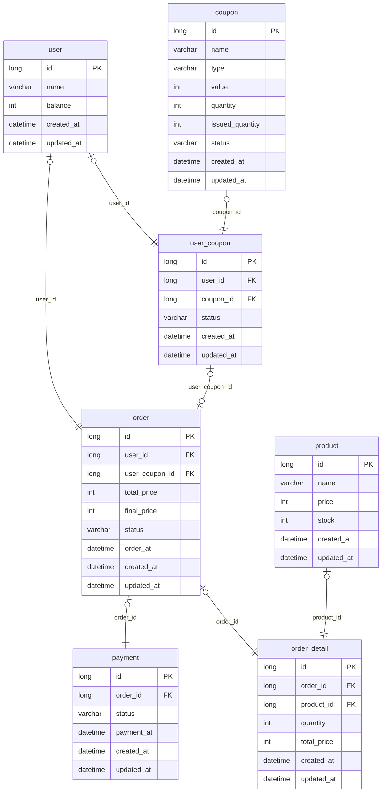

<h1>ERD</h1>

```mermaid
erDiagram
    user{
        long id PK
        varchar name
        int balance
        datetime created_at
        datetime updated_at
    }

    product{
        long id PK
        varchar name
        int price
        int stock
        datetime created_at
        datetime updated_at
    }

    order{
        long id PK
        long user_id FK
        long user_coupon_id FK
        int total_price
        int final_price
        varchar status
        datetime order_at
        datetime created_at
        datetime updated_at
    }

    order_detail{
        long id PK
        long order_id FK
        long product_id FK
        int quantity
        int total_price
        datetime created_at
        datetime updated_at
    }

    payment{
        long id PK
        long order_id FK
        varchar status
        datetime payment_at
        datetime created_at
        datetime updated_at
    }

    coupon{
        long id PK
        varchar name
        varchar type
        int value
        int quantity
        int issued_quantity
        varchar status
        datetime created_at
        datetime updated_at
    }

    user_coupon{
        long id PK
        long user_id FK
        long coupon_id FK
        varchar status
        datetime created_at
        datetime updated_at
    }


%% Relationships %%
    user |o--|| order : "user_id"
    user |o--|| user_coupon : "user_id"
    order |o--|| payment : "order_id"
    order |o--|| order_detail : "order_id"
    product |o--|| order_detail : "product_id"
    coupon |o--|| user_coupon : "coupon_id"
    user_coupon |o--o| order : "user_coupon_id"
```