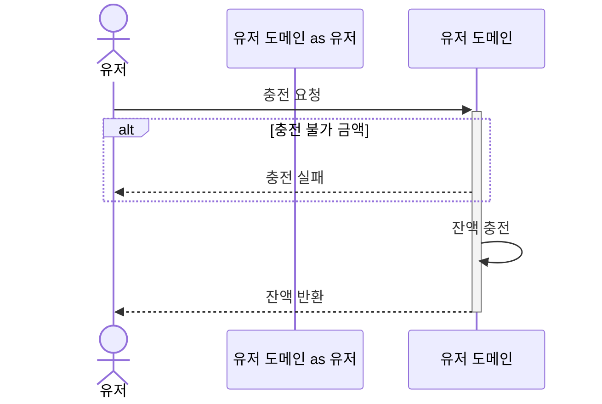
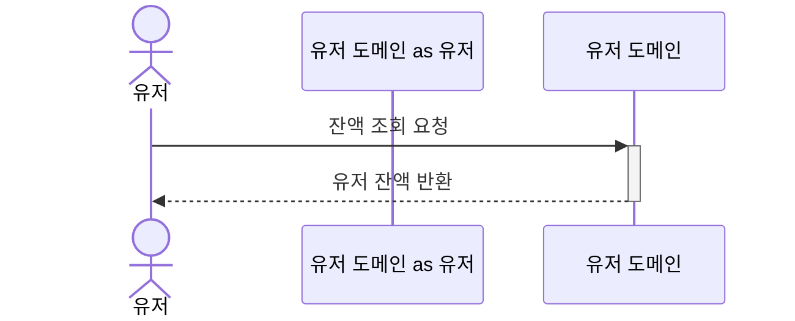
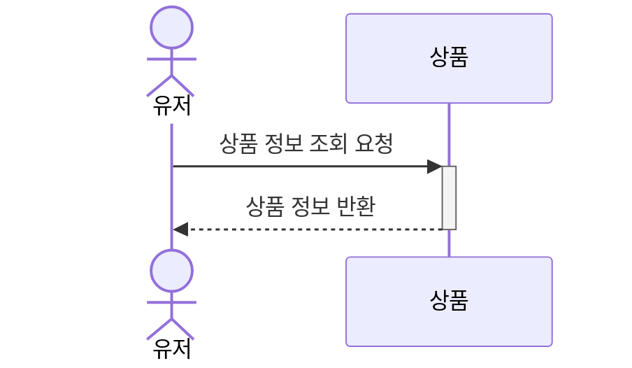
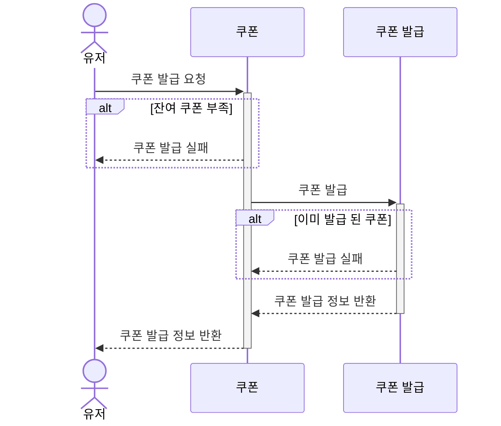
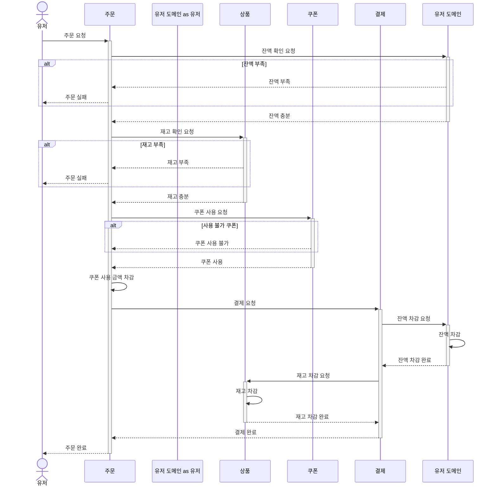
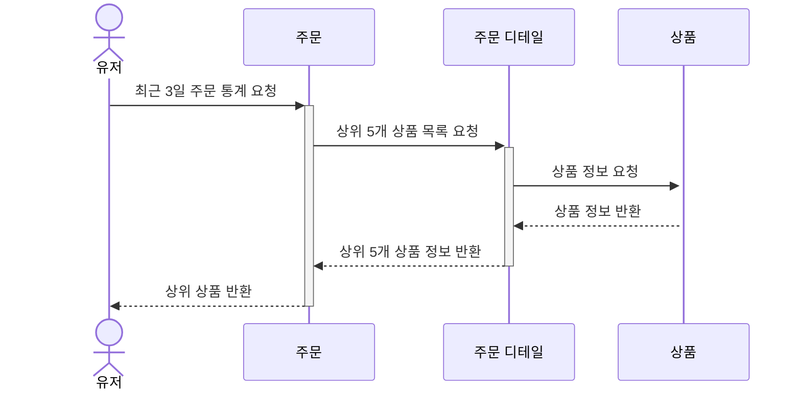

<h1>시퀀스 다이어그램</h1>

1. 잔액 충전

```mermaid
sequenceDiagram
    actor 유저
    participant 유저 도메인 as 유저

    유저 ->>+ 유저 도메인: 충전 요청
    alt 충전 불가 금액
        유저 도메인 -->> 유저: 충전 실패
    end
    유저 도메인 ->> 유저 도메인 : 잔액 충전
    유저 도메인 -->>- 유저: 잔액 반환
```

2. 잔액 조회

```mermaid
sequenceDiagram
    actor 유저
    participant 유저 도메인 as 유저

    유저 ->>+ 유저 도메인: 잔액 조회 요청
    유저 도메인 -->>- 유저: 유저 잔액 반환
```

3. 상품 조회

```mermaid
sequenceDiagram
    actor 유저
    participant 상품 

    유저 ->>+ 상품: 상품 정보 조회 요청
    상품 -->>- 유저: 상품 정보 반환
```

4. 선착순 쿠폰

```mermaid
sequenceDiagram
    actor 유저
    participant 쿠폰
    participant 쿠폰 발급

    유저 ->>+ 쿠폰: 쿠폰 발급 요청
        
    alt 잔여 쿠폰 부족
        쿠폰 -->> 유저: 쿠폰 발급 실패
    end
    쿠폰 ->>+ 쿠폰 발급: 쿠폰 발급
    alt 이미 발급 된 쿠폰
        쿠폰 발급 -->> 쿠폰: 쿠폰 발급 실패
    end 
    쿠폰 발급 -->>- 쿠폰: 쿠폰 발급 정보 반환 
    쿠폰 -->>- 유저: 쿠폰 발급 정보 반환
```

5. 주문 / 결제

```mermaid
sequenceDiagram
	actor 유저
	participant 주문
	participant 유저 도메인 as 유저
	participant 상품
	participant 쿠폰
	participant 결제
    
	
	유저 ->>+ 주문: 주문 요청
	주문 ->>+ 유저 도메인: 잔액 확인 요청
	alt 잔액 부족
	    유저 도메인 -->> 주문: 잔액 부족
	    주문 -->> 유저: 주문 실패
	end
	유저 도메인 -->>- 주문: 잔액 충분
	
	주문 ->>+ 상품: 재고 확인 요청
	alt 재고 부족
	    상품 -->> 주문: 재고 부족
	    주문 -->> 유저: 주문 실패
	end
	상품 -->>- 주문: 재고 충분
	
	주문 ->>+ 쿠폰: 쿠폰 사용 요청
	alt 사용 불가 쿠폰
	    쿠폰 -->> 주문: 쿠폰 사용 불가
	end
	쿠폰 -->>- 주문: 쿠폰 사용
	주문 ->> 주문: 쿠폰 사용 금액 차감
	
	주문 ->>+ 결제: 결제 요청
	
	결제 ->>+ 유저 도메인: 잔액 차감 요청
	유저 도메인 ->> 유저 도메인: 잔액 차감
	유저 도메인 -->>- 결제: 잔액 차감 완료
	
	결제 ->>+ 상품: 재고 차감 요청
	상품 ->> 상품: 재고 차감
	상품 -->>- 결제: 재고 차감 완료
	
	결제 -->>- 주문: 결제 완료
	주문 -->>- 유저: 주문 완료
```

6. 상위 상품 조회

```mermaid
sequenceDiagram
    actor 유저
    participant 주문
    participant 주문 디테일
    participant 상품
    
    유저 ->>+ 주문: 최근 3일 주문 통계 요청
    주문 ->>+ 주문 디테일 : 상위 5개 상품 목록 요청
    주문 디테일 ->>+ 상품 : 상품 정보 요청
    상품 -->> 주문 디테일 : 상품 정보 반환
    주문 디테일 -->>- 주문: 상위 5개 상품 정보 반환
    주문 -->>- 유저: 상위 상품 반환
```
